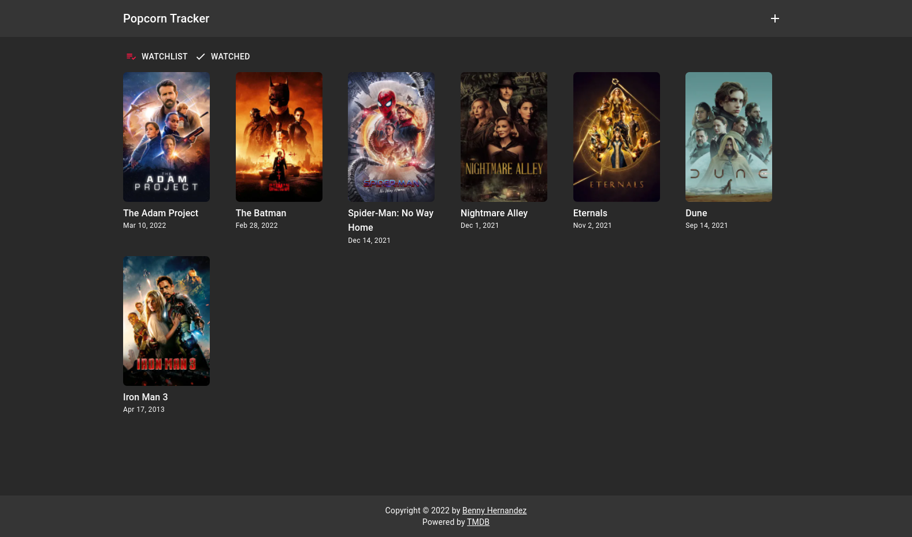

# Popcorn Tracker



#### Top Technologies

[](#) [](#) [](#) [](#) [](#) [](#)

Popcorn tracker is a full-stack movie tracking application that allows users to search movies and save them as watched or want to watch. The front-end was built using Typescript, React, Material UI. The back-end was built using Node, Nest.js, Typescript, and Postgres.

## Installation

1. Install the [backend](https://github.com/Nomad-Freedom/popcorn-tracker-server.git) companion to this front-end
2. Download repository
   ```bash
   git clone https://github.com/Nomad-Freedom/-popcorn-tracker-web.git
   ```
3. Install packages
   ```bash
   npm install
   ```

## Run in Development

1. add env.local file in root directory
   ```env
   NEXT_PUBLIC_API_URL=<<server-url>>
   ```
2. run application
   ```bash
   npm run dev
   ```

<!-- TODO: Add last video link -->

#### :mailbox: Reach out to me!

- :paperclip: [My Resume/CV](https://github.com/Nomad-Freedom/Nomad-Freedom/blob/main/resume/resume.pdf)
- :email: inquiry@bennyhernandez.com
- :link: [bennyhernandez.com](https://www.bennyhernandez.com)
